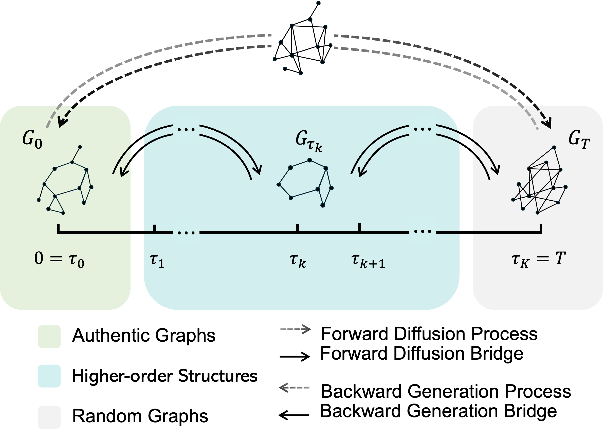

<h1 align="center"> HOG-Diff: Higher-Order Guided Diffusion for Graph Generation </h1>


Official Implementations of [HOG-Diff: Higher-Order Guided Diffusion for Graph Generation](https://arxiv.org/abs/2502.04308) (**ICLR 2026**).

[Yiming Huang](https://yimingh.top/), [Tolga Birdal](https://tolgabirdal.github.io/)

[📄 arXiv](https://arxiv.org/abs/2502.04308) · [🌐 Project page](https://circle-group.github.io/research/hog-diff/)

In this work, we propose a novel Higher-order Guided
Diffusion (HOG-Diff) model that follows a coarse-to-fine generation curriculum and is guided by higher-order information, enabling the progressive generation of authentic graphs with inherent topological structures.


<div align="center">
    
</div>

---


## Environment Setup
This code was tested with PyTorch 2.0.0, cuda 11.8 and torch_geometrics 2.6.1

1️⃣ Download anaconda/miniconda if needed

2️⃣ Create and Activate a Python Virtual Environment
```
conda create -n hogdiff python=3.9
conda activate hogdiff
```
3️⃣ Install Dependencies

Install PyTorch 2.0.0 matching your CUDA version (see the [PyTorch previous-versions page](https://pytorch.org/get-started/previous-versions/)), then the matching PyG extensions, then the rest:

```sh
# PyTorch (adjust cu118 / cu117 / cpu to your platform)
pip install torch==2.0.0+cu118 torchvision==0.15.1+cu118 --index-url https://download.pytorch.org/whl/cu118

# PyG extensions (pick the wheel for your torch / CUDA build)
pip install torch_geometric==2.6.1
pip install torch_scatter==2.1.1 -f https://data.pyg.org/whl/torch-2.0.0+cu118.html

# Remaining dependencies
pip install -r requirements.txt
```

4️⃣ Compile the ORCA Program (for Graph Generation Evaluation)

For evaluating generic graph generation tasks, compile the [ORCA](http://www.biolab.si/supp/orca/orca.html) program by running the following command:

```sh
cd evaluation/orca 
g++ -O2 -std=c++11 -o orca orca.cpp
```


# Data Setup

Datasets should be placed under `./data/<dataset_name>/`. Supported datasets:

| Dataset                                                         | Type           | Source                                                                                                                                     |
| --------------------------------------------------------------- | -------------- | ------------------------------------------------------------------------------------------------------------------------------------------ |
| `qm9`                                                           | molecular      | [QM9](https://deepchemdata.s3-us-west-1.amazonaws.com/datasets/gdb9.tar.gz)                                                                |
| `zinc250k`                                                      | molecular      | [ZINC250k](https://raw.githubusercontent.com/aspuru-guzik-group/chemical_vae/main/models/zinc_properties/250k_rndm_zinc_drugs_clean_3.csv) |
| `moses`                                                         | molecular      | [MOSES benchmark](https://github.com/molecularsets/moses)                                                                                  |
| `guacamol`                                                      | molecular      | [GuacaMol benchmark](https://github.com/BenevolentAI/guacamol)                                                                             |
| `community_small` (`cs`), `ego_small` (`ego`), `enzymes`, `sbm` | generic graphs | preprocessed `.pkl` bundled with this repo under `data/<name>/`                                                                            |

For molecular datasets, the raw files will be auto-processed into `data/<dataset>/processed/` on first run.

By default, checkpoints and processed data are resolved via the `CKPT_ROOT` and `DATA_ROOT` environment variables. Both default to the project root.

5️⃣ (Optional) Local environment overrides

Copy the template to activate per-machine overrides (wandb entity, CUDA device, custom `CKPT_ROOT`/`DATA_ROOT`, etc.). The actual `env_config.yaml` is gitignored.

```sh
cp configs/env_config.example.yaml configs/env_config.yaml
# edit configs/env_config.yaml as needed
```

# Pretrained Checkpoints

Download the pretrained checkpoints and place them under `checkpoints/<dataset>/<dataset>.pth` (or set `CKPT_ROOT` to the directory that contains your `checkpoints/` tree). The configs in `configs/<dataset>.yaml` default to this layout.

> Download link: _TBD — will be released soon._

To use a custom ckpt, pass `--ckpt /absolute/or/relative/path.pth` to `main.py`.

# Running Experiments

To train and sample graphs using HOG-Diff, use the following commands:


```shell
CUDA_VISIBLE_DEVICES=0 python main.py --config config_name --mode train_ho
CUDA_VISIBLE_DEVICES=0 python main.py --config config_name --mode train_OU
CUDA_VISIBLE_DEVICES=0 python main.py --config config_name --mode sample
```

Replace config_name with the appropriate configuration file.

# Using the Filtering Operation Standalone

The higher-order graph filtering described in the paper (Prop. 2) lives in
`utils/ho_utils.py` as two self-contained functions with no project
dependencies — you can import them in your own pipeline:

```python
import torch
from utils.ho_utils import cell_complex_filter, simplicial_complex_filter

adj = torch.tensor([[0, 1, 1, 0],
                    [1, 0, 1, 0],
                    [1, 1, 0, 1],
                    [0, 0, 1, 0]], dtype=torch.float)

# Cell-complex filter: keep edges on a cycle of length ≤ max_media_size
ccf = cell_complex_filter(adj, max_media_size=3)

# Simplicial-complex filter: keep edges inside cliques of size ≥ min_size
scf = simplicial_complex_filter(adj, min_size=3)

# Both accept a batch [B, N, N] too; max_node_num pads each output if given.
batch = torch.stack([adj, adj])
cell_complex_filter(batch, max_node_num=8)   # → [2, 8, 8]
```

To plug in a custom filter, write any function with the same signature
`(graph_tensor, max_node_num=None, ...) -> torch.Tensor` and pass it where
`ho_utils.cell_complex_filter` is called in `utils/dataloader.py`.


# Citation
Please cite our work if you find our code/paper is useful to your work. :
```bibtex
@inproceedings{hogdiff-ICLR2026,
  title={HOG-Diff: Higher-Order Guided Diffusion for Graph Generation},
  author={Huang, Yiming and Birdal, Tolga},
  booktitle={The Fourteenth International Conference on Learning Representations},
  year={2026}
}
```


 
🍀 **Thank you for your interest in our work.** 🍀

If you have any questions or encounter any issues while using our code, please contact yimingh999@gmail.com. Enjoy 😊

